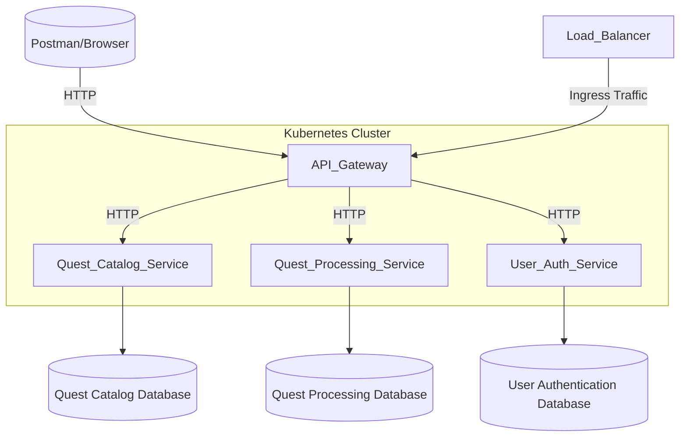

**Project Architecture**

This document explains the system architecture of the project, highlighting 
the design principles, microservice interactions, and technology choices.

---

**High-Level Overview**

The project employs a microservice architecture with the following components:

* API Gateway: Acts as the entry point for all requests, routing traffic to respective microservices.
* Quest Catalog Service: Manages quest definitions, rewards, and related metadata.
* Quest Processing Service: Handles user-specific quest progress and rewards processing.
* User Authentication Service: Manages user registration, authentication, and reward distribution.
* Databases: PostgreSQL instances, one per service, ensuring service-specific data storage.

**Architecture Diagram**

---

**Service Responsibilities**

1. API Gateway
    * Routes incoming requests to appropriate services.
    * Handles load balancing via Kubernetes.
    * Provides a single point of entry for external clients.

2. Quest Catalog Service
    *    Stores and manages quest definitions and rewards.
    *    Exposes endpoints for fetching quest data.

3. Quest Processing Service
    *    Tracks user-specific quest progress and streaks.
    *    Handles reward allocation logic based on quest completion.

4. User Authentication Service
    *    Manages user signup, login, and authentication.
    *    Updates user rewards upon quest completion.

5. Databases
    *    Each microservice has a dedicated PostgreSQL database for isolation and scalability.

---
**Data Flow**

1. User Interaction:
   * Users interact with the system through the API Gateway.
   * Requests are routed to the appropriate microservices.

2. Quest Lifecycle:
   * Quests are defined in the Quest Catalog Service.
   * User progress is tracked in the Quest Processing Service.
   * Upon quest completion, rewards are allocated via the User Authentication Service.

3. Database Interaction:
   * Each service interacts only with its own database to ensure data integrity and isolation.

Technologies Used
|Component	|Technology|
|:----------:|:-----------:|
|API Gateway|	FastAPI|
|Quest Services|	FastAPI|
|Databases|	PostgreSQL|
|Orchestration|	Kubernetes|
|Containerization|	Docker|
|Load Balancing	|Kubernetes Ingress|
|Deployment Strategy|	Rolling Updates|
|Monitoring (optional)	|Prometheus, Grafana|

---